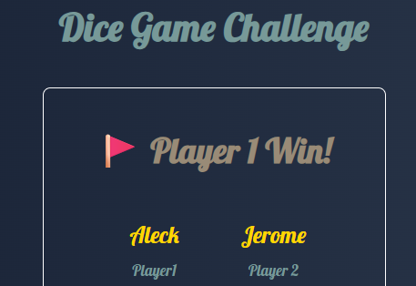

      <a class="p-5 max-w-lg  rounded-2xl flex flex-col items-center bg-[#24133649]   border  border-gray-900   shadow-lg shadow-blue-600/10 "
        href="#">
        

          
        

        
        

          <h4 class="font-bold text-xl  text-white ">Dice Game Challenge</h4>
          
A personal portfolio website to showcase my skills and projects.

          

            <button type="button"
              class="inline-flex items-center rounded-md border border-transparent bg-gray-800 px-3 py-2 text-sm font-medium leading-4 text-white shadow-sm hover:bg-gray-900">View
              Project</button>
          

        

      </a>
      <a class="p-5 max-w-lg  rounded-2xl flex flex-col items-center bg-[#24133649]   border  border-gray-900   shadow-lg shadow-blue-600/10 "
        href="#">
        

          
        

        
        

          <h4 class="font-bold text-xl  text-white ">Web A Calculator</h4>
          
A personal portfolio website to showcase my skills and projects.

          

            <button type="button"
              class="inline-flex items-center rounded-md border border-transparent bg-gray-800 px-3 py-2 text-sm font-medium leading-4 text-white shadow-sm hover:bg-gray-900">View
              Project</button>
          

        

      </a>

    
